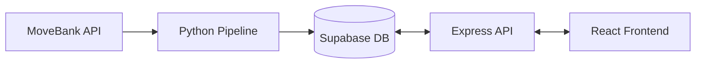

# WildPath MVP Feature Plan

## Overview

This plan covers the full scope of the WildPath MVP, assigned across 5 people over **1–2 weeks**. Each section maps to specific tasks, code locations, and dependencies so everyone knows what to build, in what order, and what to wait on.

**Effort sizes:**

- **S** ≈ 0.5 day
- **M** ≈ 1–2 days
- **L** ≈ 3–4 days

---

## What We're Building


| Feature                  | Description                                               |
| ------------------------ | --------------------------------------------------------- |
| Interactive 2D map       | Mapbox GL JS showing wildlife sighting data from Supabase |
| Animal/species search    | Search and select a species to focus the map              |
| Markers & movement paths | Sighting markers with optional path overlays              |
| Filters                  | Filter by region (viewport), time range, and species      |
| Insights panel           | Simple stats — counts per species, activity over time     |


**Tech stack:**

- `frontend/` — React + Vite, Mapbox, shadcn
- `backend/` — Express + Supabase client
- `pipeline/` — Python ingestion (MoveBank → Supabase)

---

## Architecture



**Frontend calls:**

- `GET /api/species` — species list + search
- `GET /api/sightings` — markers/paths with filters
- `GET /api/insights` — basic stats for current filters

**Backend** translates filter params into Supabase/Postgres queries.

**Pipeline** periodically fetches MoveBank data and upserts into `animals` and `sightings` tables.

---

## Section 1 — Data Model & Pipeline

### Task 1.1 — Design DB Schema *(L, must be done first)*

> **Owner: Person A** | `backend/README.md` or `docs/schema.md`

Define the two core tables in Supabase:

`**animals` table**


| Column          | Type   | Notes                     |
| --------------- | ------ | ------------------------- |
| id              | UUID   | Primary key               |
| movebank_id     | string | Unique                    |
| name            | text   | Nullable                  |
| scientific_name | text   |                           |
| common_name     | text   |                           |
| species_group   | text   | Optional (e.g. "raptors") |


`**sightings` table**


| Column                 | Type             | Notes                          |
| ---------------------- | ---------------- | ------------------------------ |
| id                     | UUID             | Primary key                    |
| animal_id              | UUID             | FK → animals.id                |
| movebank_individual_id | string           |                                |
| timestamp              | timestamptz      | Indexed                        |
| latitude / longitude   | numeric          | Or PostGIS point               |
| geom                   | PostGIS geometry | Optional, for spatial indexing |
| study_id               | int              |                                |


**Deliverables:**

- Schema doc written in README.md (or `docs/schema.md`)
- Tables and indexes created via Supabase SQL (index on `timestamp` and `latitude/longitude` or `geom`)

**Dependencies:** None — but this must be done before backend query work and pipeline upserts can begin.

---

### Task 1.2 — Ingestion Pipeline for One Study *(L, partially parallel)*

> **Owner: Person A** | `pipeline/src/`

Build a working ingestion path for **one configured study**:

1. `movebank.py` — implement `get_animals(study_id)` and `get_events(study_id)` using MoveBank API
2. `transform.py` — implement `normalize_animals` and `normalize_events` to map MoveBank fields to DB schema
3. `ingest.py` — implement `run(study_id)` to:
  - Load env vars from `.env`
  - Fetch animals + events
  - Normalize with pandas
  - Upsert into `animals` and `sightings` via Supabase Python client (batch ~500 rows)

**Dependencies:** Task 1.1 schema must be finalized first.

---

### Task 1.3 — Multi-Study Support *(M, optional for MVP)*

> **Owner: Person A** | `pipeline/src/`

- Read `MOVEBANK_STUDY_IDS` from env as a comma-separated list
- Loop over study IDs in `run()`
- Document how to run pipeline manually: `python src/ingest.py`
- *(Optional)* Outline cron/scheduler config

---

## Section 2 — Backend API

### Task 2.1 — API Contract Definition *(S, must be done first)*

> **Owner: Person B** | `backend/API.md`

Write a short spec covering all three endpoints. This is the contract that unblocks frontend work.

`**GET /api/species`**

- Params: `q` (search string), `limit` (default 20)
- Response: `[{ id, common_name, scientific_name }]`

`**GET /api/sightings**`

- Params: `species_id?`, `bbox?`, `start?`, `end?`, `limit?`
- `bbox` format: `minLng,minLat,maxLng,maxLat`

`**GET /api/insights**`

- Same filter params as `/api/sightings`
- Response: `{ totalSightings, byAnimal, byDay }`

---

### Task 2.2 — `GET /api/species` Endpoint *(M, sequential)*

> **Owner: Person B** | `backend/src/routes/species.ts`

- Query Supabase `species` table, ordered by `common_name`
- If `q` is provided: case-insensitive `ilike` on `common_name` and `scientific_name`
- Limit results to 20–50 for search dropdown performance

**Dependencies:** Task 1.1 schema. Can use mock data before pipeline is ready.

---

### Task 2.3 — `GET /api/sightings` Endpoint *(M–L, sequential)*

> **Owner: Person B** | `backend/src/routes/sightings.ts`

- Parse params: `species_id`, `bbox`, `start`, `end`, `limit`
- Build Supabase query:
  - Inner join `animals` and filter by `animals.species_id` when `species_id` provided
  - Filter `timestamp` between `start` and `end`
  - If `bbox` provided: numeric compare on `latitude/longitude` (PostGIS upgrade later)
- Limit rows to 5,000 to keep map performant
- Return: `{ id, animal_id, latitude, longitude, timestamp }`

**Dependencies:** Task 1.1. Can be tested with seed data before pipeline is ready.

---

### Task 2.4 — `GET /api/insights` Endpoint *(M, after 2.3)*

> **Owner: Person B** | `backend/src/routes/insights.ts`

- Accept same filter params as `/api/sightings`
- Return:
  - `totalSightings` — total count for filter set
  - `byAnimal` — `[{ animal_id, count }]`
  - `byDay` or `byMonth` — grouped counts over time (for trend chart)

**Dependencies:** Task 2.3 for query-building helpers; Task 1.2 for real data.

---

### Task 2.5 — Wire Routes & Health Check *(S, parallel)*

> **Owner: Person B** | `backend/src/index.ts`

- Mount `species`, `sightings`, and `insights` routers under `/api/`
- Confirm `/health` endpoint works and is documented

---

## Section 3 — Frontend

### Task 3.1 — Map Shell & Layout *(S–M, can start immediately)*

> **Owner: Person C** | `frontend/src/pages/MapPage.tsx`

- Full-screen layout (`h-screen`, split pane if desired)
- Integrate Mapbox GL / react-map-gl with a basic world-centered map
- Wire up Mapbox token from `VITE_MAPBOX_TOKEN`

**Dependencies:** None — start with hard-coded markers.

---

### Task 3.2 — Sighting Markers on Map *(M–L, depends on 2.3)*

> **Owner: Person C** | `frontend/src/pages/MapPage.tsx`

- Track filter state: `selectedAnimalId`, `timeRange`, current `bbox` from viewport
- Use React Query to call `GET /api/sightings` with current filters
- Render markers (circles or pins) at `lat/lng` with a tooltip/popup
- Cap visible markers at a reasonable N; add basic clustering if needed

**Dependencies:** Task 2.3. Task 1.2 for real data.

---

### Task 3.3 — Movement Paths Toggle *(M, after 3.2)*

> **Owner: Person C**

- Group sightings by `animal_id` on the client
- Draw lines connecting sorted timestamps per animal when "Show paths" toggle is enabled
- UI: shadcn `Switch` or `Checkbox` in a small control bar

**Dependencies:** Task 3.2 working markers.

---

### Task 3.4 — Animal Search UI *(M, parallel with backend 2.2)*

> **Owner: Person D** | `frontend/src/components/AnimalSelector`

- Text input with debounce
- List/dropdown of species from `GET /api/species?q=...`
- Emits selected `animal_id` to parent state
- Wire into `MapPage` via React state or context

**Dependencies:** Task 2.1 API contract. Can use mocked responses before Task 2.2 is live.

---

### Task 3.5 — Filters Panel *(M, parallel)*

> **Owner: Person D**

- **Region filter:** derived from map viewport; update query on pan/zoom end
- **Time filter:** date range selector (Last 7 days / 30 days / All)
- **Species filter:** integrated with `AnimalSelector`
- All filters feed into `GET /api/sightings` calls

**Dependencies:** Task 2.1 for filter param format. Can mock before Task 2.3 is live.

---

### Task 3.6 — Insights Panel *(M, after 2.4)*

> **Owner: Person D**

- Consume `GET /api/insights` in `MapPage`
- Show a shadcn card with:
  - Total sightings for current filters
  - Top N species by count
  - Optional: simple trend bar chart or list

**Dependencies:** Task 2.4 backend endpoint.

---

## Section 4 — Testing & Docs

### Task 4.1 — Tests & Fixtures *(M, parallel once endpoints/components exist)*

> **Owner: Person E** (with B, C, D)

- **Backend:** Unit tests for `/api/species`, `/api/sightings`, `/api/insights` using a small test Supabase dataset or mocked Supabase client
- **Frontend:** Component tests for `AnimalSelector` and map filter behavior (no full E2E needed for MVP)

---

### Task 4.2 — Developer Experience & Docs *(S–M, parallel)*

> **Owner: Person E** (with all)

Update root `README.md` to include:

- How to run the pipeline with a sample study
- How to seed Supabase with a tiny local dataset
- Example `.env` values for local dev

---

## Team Assignments & Sequence

### Arnav Bagmar — Data & Pipeline


| Task | Description                                                | Size |
| ---- | ---------------------------------------------------------- | ---- |
| A1   | Design & document Supabase schema (§1.1)                   | L    |
| A2   | Implement ingestion pipeline for one MoveBank study (§1.2) | L    |
| A3   | Document pipeline usage + optional smoke test (§4.1–4.2)   | S    |


**Order:** A1 → A2 → A3. Can run in parallel with frontend/backend once A1 is agreed on.

---

### Daniel Dovale - Person B — Backend APIs


| Task | Description                                    | Size |
| ---- | ---------------------------------------------- | ---- |
| B1   | Write API contract doc (§2.1)                  | S    |
| B2   | Implement `/api/animals` with search (§2.2)    | M    |
| B3   | Implement `/api/sightings` with filters (§2.3) | M–L  |
| B4   | Implement `/api/insights` (§2.4)               | M    |
| B5   | Add endpoint tests + README docs (§4.1–4.2)    | M    |


**Order:** B1 first. Then B2 and B3 in parallel (both need schema from A1). B4 after B3. B5 after B2–B4 stabilize.

---

### Kaitlyn Tran - Person C — Frontend Map Core


| Task | Description                                         | Size |
| ---- | --------------------------------------------------- | ---- |
| C1   | Map shell: full-screen layout + Mapbox wired (§3.1) | S–M  |
| C2   | Render sighting markers from backend data (§3.2)    | M–L  |
| C3   | Add movement path toggle (§3.3)                     | M    |


**Order:** C1 immediately (use mocked data). C2 once B3 has at least a stub. C3 after markers are working.

---

### Person D — Frontend Controls & Insights


| Task | Description                                            | Size |
| ---- | ------------------------------------------------------ | ---- |
| D1   | Build `AnimalSelector` search component (§3.4)         | M    |
| D2   | Implement filters panel (region, time, species) (§3.5) | M    |
| D3   | Implement insights panel (§3.6)                        | M    |


**Order:** D1 after B1 API contract (mock B2 initially). D2 in parallel with D1 once filter format is agreed (B1/B3). D3 after B4 is available or stubbed.

---

### Person E — QA, Glue & Docs


| Task            | Description                                                                    |
| --------------- | ------------------------------------------------------------------------------ |
| E1              | Backend tests (with B), frontend tests (with C & D), README updates (§4.1–4.2) |
| E2 *(optional)* | Help wire backend routes, verify `/health`, validate env examples              |


**Order:** E1 runs in parallel once initial endpoints and components exist (after B2/B3, D1/D2, C2). E2 can happen early to unblock local dev setup.

---

## Dependency Map (Quick Reference)

```
A1 (schema)
  └─► A2 (pipeline)
  └─► B2 (species endpoint)
  └─► B3 (sightings endpoint)
        └─► B4 (insights endpoint)
              └─► D3 (insights UI)
        └─► C2 (map markers)
              └─► C3 (movement paths)

B1 (API contract)
  └─► D1 (animal selector UI)
  └─► D2 (filters panel)
```

